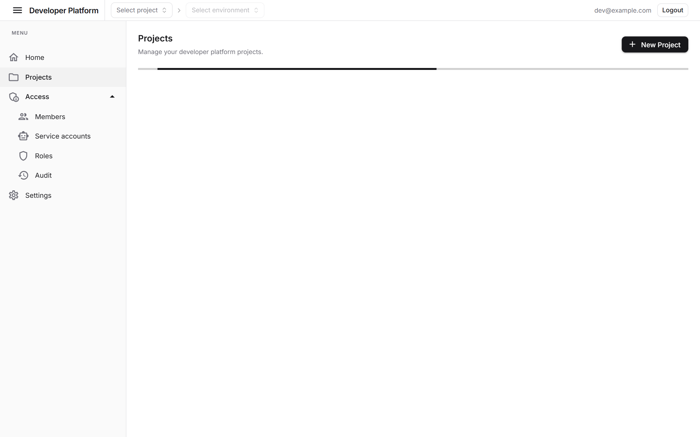
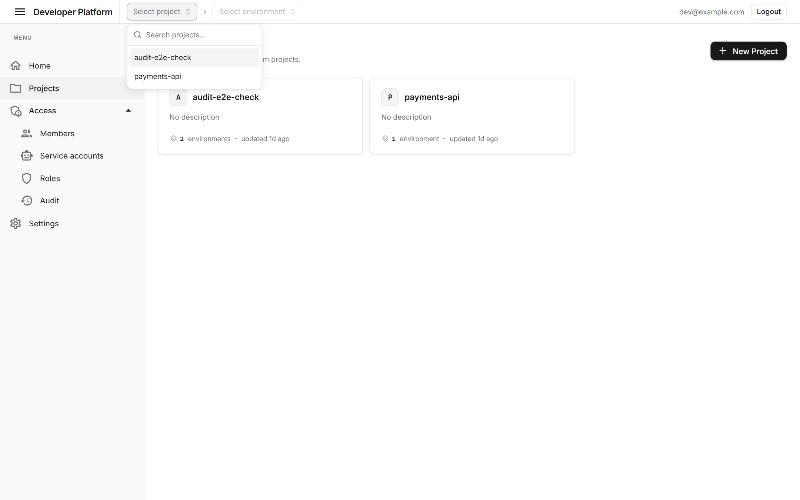
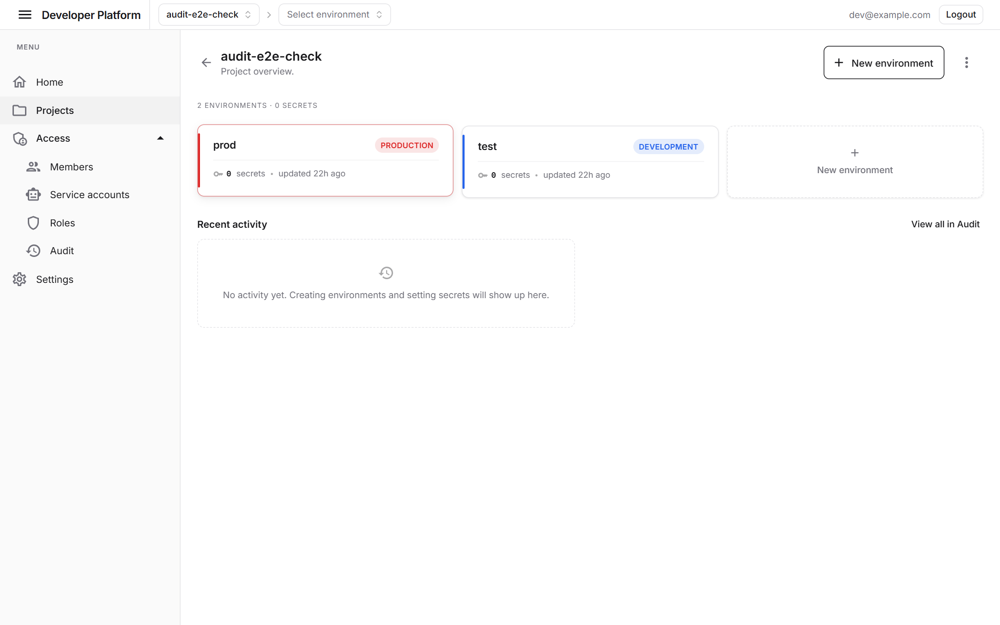
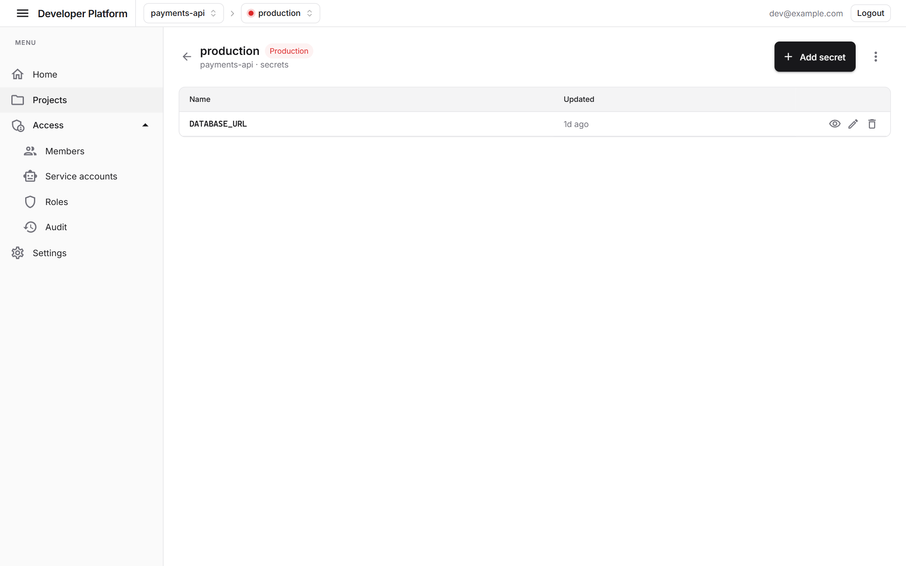
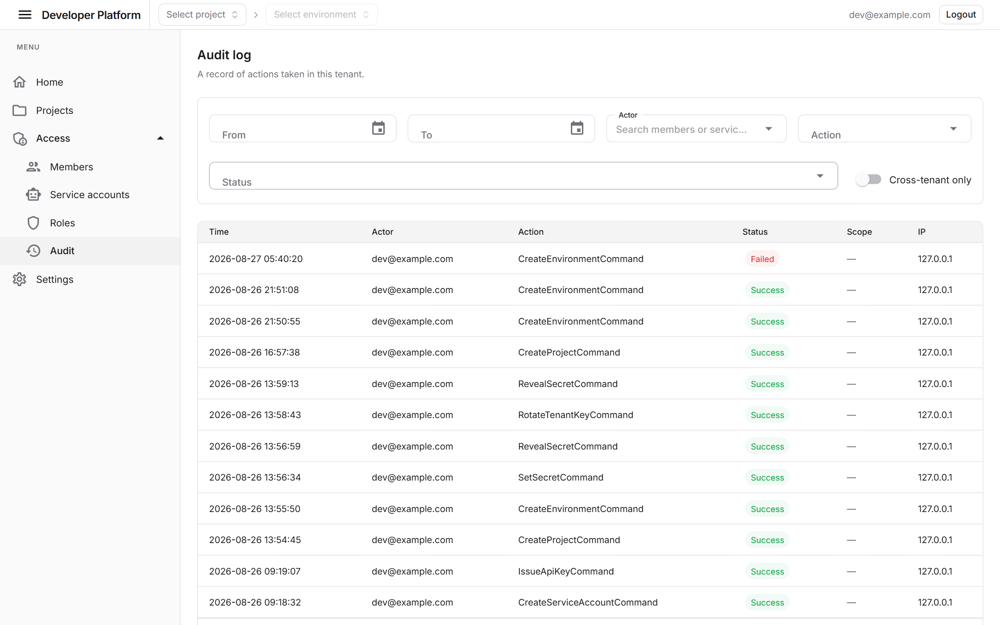
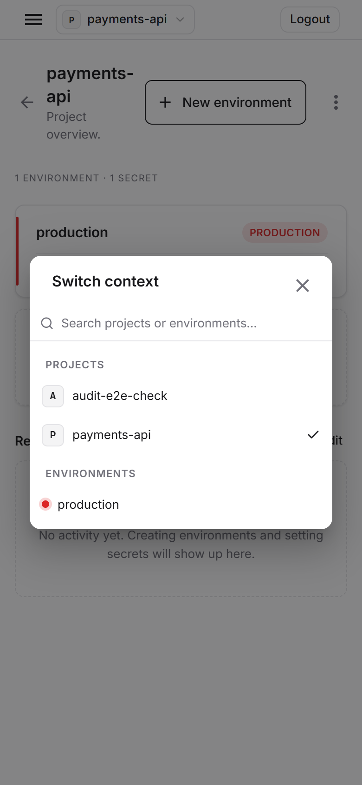

# Developer Platform Reference

A multi-tenant **developer platform** reference application — manage projects, environments, and encrypted secrets, with role-based access control and a tamper-evident audit log. Built as a clean, end-to-end example of modern .NET architecture.



## Screenshots

<table>
  <tr>
    <td width="50%">
      <strong>Project & environment switcher</strong><br/>
      A persistent command-style combobox in the app bar — searchable, keyboard-navigable.
      
    </td>
    <td width="50%">
      <strong>Project overview</strong><br/>
      Environments at a glance, colour-coded by type (production / staging / development).
      
    </td>
  </tr>
  <tr>
    <td width="50%">
      <strong>Environment secrets</strong><br/>
      Per-environment secrets with reveal / edit / delete, encrypted at rest.
      
    </td>
    <td width="50%">
      <strong>Audit log</strong><br/>
      Filterable, paged record of every action taken in the tenant.
      
    </td>
  </tr>
  <tr>
    <td width="50%">
      <strong>Mobile context switch</strong><br/>
      On phones, a compact acronym button opens a searchable "Switch context" dialog.
      
    </td>
    <td width="50%"></td>
  </tr>
</table>

## Features

- **Projects, environments & secrets** — organise work by project, split into environments, store per-environment secrets encrypted with **per-tenant AES-256-GCM** keys (old keys retained so historical audit payloads stay readable).
- **Access control** — members, invitations, service accounts, API keys, and roles with fine-grained, scope-aware permission grants.
- **Audit log** — every command is recorded via a transactional outbox and relayed to an audit store; the viewer supports multi-select and searchable filters and on-demand payload decryption.
- **Multi-tenant** — shared-table tenancy enforced by an EF Core global query filter, with an explicit cross-tenant operation path.
- **Authentication** — Keycloak OIDC (cookie + code flow for the web app, JWT bearer for the API), with JIT user provisioning and invitation-gated onboarding.
- **Polished UI** — MudBlazor with a custom zinc theme, an environment colour-identity system, a shadcn-style command combobox, and responsive layouts down to mobile.

## Tech stack

| Area | Technology |
|------|-----------|
| Runtime | .NET 10 |
| Web UI | Blazor Server (globally interactive) + MudBlazor |
| API | ASP.NET Core Minimal APIs, API versioning, OpenAPI/Scalar |
| Data | EF Core 10 + Pomelo (MariaDB) |
| Messaging | RabbitMQ (audit outbox relay) |
| Cache / sessions | Redis (Data Protection keys, session) |
| Auth | Keycloak (OIDC / JWT) |
| Testing | xUnit (unit/integration) + Playwright (e2e) |

## Architecture

Clean Architecture with CQRS:

```
src/
  DeveloperPlatform.Domain          # entities, value objects, invariants (no dependencies)
  DeveloperPlatform.Application      # commands, queries, dispatchers, ports
  DeveloperPlatform.Infrastructure   # EF Core, crypto, messaging, auth, query/command handlers
  DeveloperPlatform.Api              # HTTP endpoints (JWT / API-key auth)
  DeveloperPlatform.Web              # Blazor Server front end (cookie + OIDC)
```

Commands and queries flow through custom `ICommandDispatcher` / `IQueryDispatcher` abstractions; permission and tenant scoping are enforced in the dispatch pipeline. Architecture rules are asserted by `tests/DeveloperPlatform.ArchitectureTests`.

## Getting started

**Prerequisites:** .NET 10 SDK, Docker.

1. Start the backing services (MariaDB, Redis, RabbitMQ, Keycloak):

   ```bash
   docker compose up -d
   ```

2. Run the API (listens on `http://localhost:5274`):

   ```bash
   dotnet run --project src/DeveloperPlatform.Api
   ```

3. Run the web app on port **5000** (the Keycloak redirect URI is fixed to `http://localhost:5000/signin-oidc`):

   ```bash
   ASPNETCORE_ENVIRONMENT=Development ASPNETCORE_URLS=http://localhost:5000 \
     dotnet run --project src/DeveloperPlatform.Web --no-launch-profile
   ```

4. Open `http://localhost:5000` and sign in with the seeded user:

   - **Email:** `dev@example.com`
   - **Password:** `password`

   The first user to sign in becomes the tenant **Owner**.

## Testing

```bash
# unit + integration + architecture tests
dotnet test

# end-to-end (requires the stack running on :5000/:5274)
cd tests/e2e
npm install
npx playwright test
```

## Repository layout

```
src/        application code (Domain / Application / Infrastructure / Api / Web)
tests/      xUnit test projects + Playwright e2e (tests/e2e)
infra/      Keycloak realm export and login theme
docs/       design specs, implementation plans, and screenshots
```
